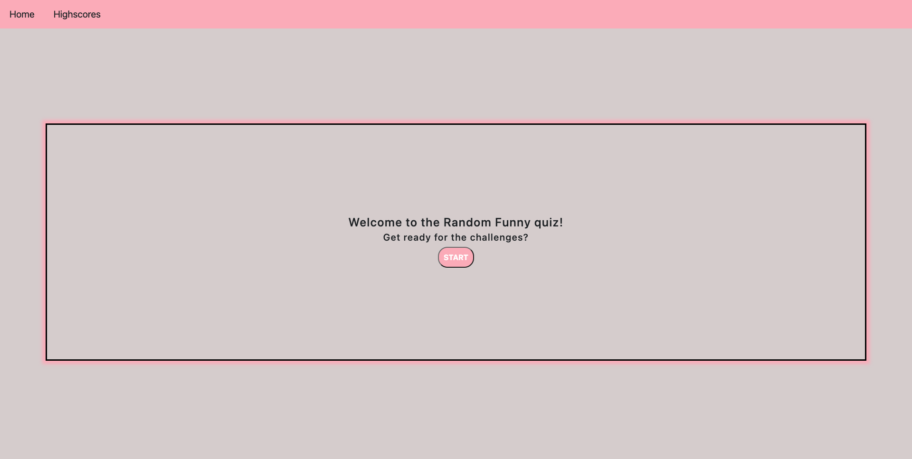

# Random Funny Quiz

## About this Project

```
This project is developed to emable users to have some fun taking sets of random questions. Users will be presented with a few multiple choice questions and will be offered access to their scores. The quiz has a countdown feature and the score is the remaining timer value at the end of the quiz..
This quiz project is focussing on using DOM, Javascript and localStorage。Highly recommended to first-timers who are trying to learn those concepts.
```

## Links to the Project

Check out the Github Repository [Here](https://github.com/jinyiyu/code-quiz)

Check out the deployed URL [Here](https://jinyiyu.github.io/code-quiz/)

<br>

## User Story

```
I WANT to take a timed quiz on JavaScript fundamentals that stores high scores
SO THAT I can gauge my progress compared to my peers

GIVEN I am taking a randon quiz
WHEN I click the start button
THEN a timer starts and I am presented with a question
WHEN I answer a question
THEN I am presented with another question
WHEN I answer a question incorrectly
THEN time is subtracted from the clock
WHEN all questions are answered or the timer reaches 0
THEN the game is over
WHEN the game is over
THEN I can save my initials and my score
```

## Mock-Up

The following screenshots in the taggle list show the web application's appearance and functionality:

<details>
<summary> Welcome banner Page</summary>



</details>

<details>
<summary> Start Take the questions with a timer</summary>


</details>

<details>
<summary> End the quiz</summary>


</details>

<details>
<summary> Go to highscrose page to compare with other player</summary>


</details>

<br>

## Technology Used

- HTML
- CSS
- Javascript
- Bootstrap
- Github

<br />

## How To Contact Me

Please contact me if you have any inquiries

[](https://github.com/jinyiyu)
[](https://www.linkedin.com/in/jinyiyu/)
[](https://www.instagram.com/jinyiyu517/)
[](mailto:yujinyiicxk@gmail.com)

## Authored by

### **Jinyi Yu**
